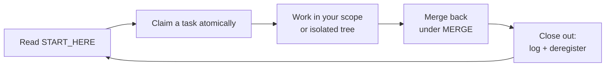

 

[

**Governance infrastructure for AI-agent development teams.**
One folder. One prompt. Multiple agents working in parallel — without
ever touching each other's work.

[Get started](#quick-start) ·
[How it works](#how-it-works) ·
[What you get](#what-you-get) ·
[FAQ](#faq)

---

## Why System Kit Exists

AI coding agents are force multipliers — until you run more than one.
Then this happens:

| # | Failure | Real-world cost |
|---|---|---|
| 1 | Two agents edit the same files | Silent overwrites, lost work, broken builds |
| 2 | Agent invents APIs that don't exist | Confidently wrong implementations shipped |
| 3 | Untested code reaches production | Dead pages, broken checkout, angry users |
| 4 | Context compaction mid-task | Re-researching the same problem twice |
| 5 | Cumulative data labeled as daily | Users catch the error before you do |
| 6 | Rotated free-tier models | Quotas burned on routing errors |
| 7 | API keys read into chat | Secrets sent to third-party servers |
| 8 | Two agents claim the same task | Both "win", one overwrites the other |

Every one of these happened to me. I'm not a professional developer — I
build products with AI agents, and I learned each lesson the expensive
way. System Kit is the system that came out of it: **the failure above
maps to a specific, documented, and where possible machine-enforced
prevention.** Proven across 26+ concurrent agent sessions with zero
code collisions.

## Quick Start

**You never edit files by hand.** The setup is one pasted prompt.

1. **Get the kit** — green **Code** button → **Download ZIP** → unzip anywhere.
2. **Open your AI agent in your project** — opencode, Claude Code, Cursor, Codex CLI, or any agent that can read and write files.
3. **Paste `SETUP_PROMPT.md`** — open it from the unzipped kit, copy the whole file, paste it as your first message, and tell the agent where the kit folder lives.
4. **Answer plain-English questions** — the agent scans your project, auto-detects what your environment supports (shell? git? CI?), builds the governance files, installs the enforcement scripts, and fills in everything.
5. **Confirm** — it shows you the finished system and asks: *"Is anything missing?"*

That's it. Every new agent thread now starts at `docs/START_HERE.md`,
claims its task through an atomic, machine-checked claim, and works
inside a declared scope that no other thread can touch.

> **Upgrading an existing install?** Paste the same setup prompt again —
> it detects the prior install and upgrades in place (registry format
> conversion included). Nothing is ever rebuilt from scratch.

> [!NOTE]
> See a [fully initialized START_HERE.md](examples/example-START_HERE.md)
> and a [live THREADS registry](examples/example-THREADS.md) to know
> what "done" looks like before you start.

## How It Works

### The thread lifecycle

Every thread follows the same loop, enforced at three checkpoints:

| Checkpoint | What's enforced | How |
|---|---|---|
| **Claim** | One task = one owner; scopes disjoint from every live thread | `register-thread.sh` under a filesystem lock — racing claims: exactly one wins |
| **Commit** | Staged files inside the claimer's declared scope only | pre-commit hook (git projects); registry files always allowed |
| **Merge** | One merge-back at a time; main tree never half-merged twice | `MERGE` mutex serializes all worktree/copy consolidations |

### The five-mutex model

| Mutex | Guards | Hold duration |
|---|---|---|
| `CODE` | A **declared scope** — parallel holders allowed iff scopes are disjoint | Task-long |
| `LEDGER` | Shared tracking docs — append-only, registry-locked | Seconds per edit |
| `DB-CF` | Database / cloud infrastructure | Action-long |
| `DEPLOY` | All server execution — one deploy at a time, from complete handoffs only | One deployment |
| `MERGE` | One merge-back of an isolated tree at a time | One merge |

A global lock serializes everything behind the slowest thread. Scoped
locks let the docs thread, the `src/api/` thread, and the `src/ui/`
thread all run at once — because their scopes provably don't touch.

### The four lanes

Every thread declares a lane at claim time and never crosses it
mid-task — the blast radius of any single agent is capped by design:

| Lane | Does | Never does |
|---|---|---|
| `STRATEGY` | Plans, specs, research verdicts | Write code; touch any server |
| `DOCS` | Content, drafts, ledger syncs | Write code; touch any server |
| `CODE` | Code + full verification gate + push; files a **Deploy Handoff** at close-out | **Touch any server** |
| `DEPLOY` | All server execution — from complete handoffs only, refuses incomplete ones | Write code; touch the working tree |

The connective tissue is the **Deploy Handoff + refusal rule**: CODE
threads file a 10-item handoff (pinned version, concrete smoke list,
rollback that works, gate evidence with numbers); DEPLOY threads
**refuse incomplete handoffs** — the party with the most to lose from
a vague deploy is the one who must reject it. That's the entire trick.
Projects without a deploy target keep the DEPLOY lane dormant; the
system detects it at setup from existing answers — zero new questions.

### Isolation modes

| Mode | Requires | Use when |
|---|---|---|
| `main` | Nothing | Small/short tasks with a cleanly disjoint scope |
| `worktree` | Git | Long code tasks — own tree, own branch, conflicts deferred to merge |
| `copy` | Nothing | Same as worktree, for no-git local folders |

### Runs anywhere

| Environment | What you get |
|---|---|
| Plain local folder, no git, no CI | Atomic claims, scoped parallel CODE, folder-copy isolation, stale detection |
| Git repo (local or hosted) | + worktree isolation + commit-scope hook |
| Hosted with CI | + pairwise scope gates, stale-thread gate, checkpoint validation |

Detection is automatic at setup — the same one prompt installs exactly
what your machine supports. No configuration, no new questions.

### The failure map

| Failure (from the table above) | Prevention |
|---|---|
| 1 — agents overwrite each other | Four-mutex model + atomic claims + scope enforcement |
| 2 — invented APIs | Verification gate: nothing "done" until tests pass locally |
| 3 — untested code in prod | Five-step order: local suite → commit → deploy → smoke → owner verify last |
| 4 — lost decisions | Checkpoint/resume system + append-only ledgers |
| 5 — mislabeled data | Data-honesty law: cumulative ≠ daily, labels match reality |
| 6 — dead models | Optional live-probing model rotation |
| 7 — leaked keys | Secrets never enter tracked files or LLM context |
| 8 — double task claims | Registry lock — two racers, exactly one row lands |

## What You Get

| Capability | How |
|---|---|
| Multi-thread coordination | Five-mutex model, scoped parallel CODE, live registry |
| Four-lane blast-radius control | STRATEGY/DOCS/CODE/DEPLOY declared at claim; CODE never touches servers; DEPLOY never writes code |
| Machine-checked claims | Atomic register script — race-free, overlap-rejecting |
| Deploy handoff + refusal rule | 10-item handoff, machine-validated; incomplete handoffs refused before anything deploys |
| Commit-scope enforcement | Pre-commit hook (git); glob scopes (`src/**/*.test.ts`) enforced identically at claim, CI, and commit |
| Stale-thread detection | `check-stale.sh` — abandoned claims can't hide |
| Security posture | `check-security.sh` — credential + injection-marker scan; values never echoed |
| One-command health | `governance-health.sh` — structure, registry, scope, stale, checkpoints, laws, security, deploy-queue linkage, buildlog |
| Task queue with claim/lock/release | Single entry point + priority queue + dependency tracking |
| Verification gates | Local-first, five-step order, owner verifies last |
| Institutional memory | Append-only ledgers + checkpoint/resume |
| Push discipline | Ledger currency required; owner-gated deployments |
| Key isolation | Credentials handled internally, never exposed to agents |
| Plain-language owner gate | Simple English decisions; owner interrupted only when necessary |
| Universal deployment | Git or none, CI or none, deploy target or none, any stack, any agent |
| Optional model rotation | Live probing for rotating free-tier catalogs |

## Patterns Included

Each pattern documents the real failure class it prevents:

| Pattern | Prevents |
|---|---|
| [Concurrency Protocol](patterns/concurrency.md) | Parallel threads overwriting each other's work |
| [Verification Standard](patterns/verification.md) | Untested code reaching production |
| [Security Checklist](patterns/security-checklist.md) | Credential leaks, injection, unsafe defaults |
| [Failure Classes](patterns/failure-classes.md) | Twelve documented bug classes — with evidence |
| [Cost-Zero Operation](patterns/cost-zero-operation.md) | Quota burn and surprise cloud bills |
| [Model Rotation](patterns/model-rotation.md) | Dead/rotated free-tier models breaking sessions |
| [Prompt Injection Defense](patterns/prompt-injection-defense.md) | Malicious instructions hidden in project data |
| [Context Window Management](patterns/context-window-management.md) | Decisions lost to context compaction |
| [Worktree Parallel Coding](patterns/worktree-parallel.md) | Long code tasks queuing behind each other (git) |
| [Folder-Copy Parallel Coding](patterns/folder-copy-parallel.md) | Long code tasks queuing behind each other (no git) |
| [Four-Lane Threads](patterns/four-lane-threads.md) | One agent holding both the keyboard and the server keys |
| [Non-VCS Mutex](patterns/non-vcs-mutex.md) | Losing concurrency guarantees without version control |

## Who It's For

- **Non-technical founders** building with AI agents who can't afford silent failures
- **Solo developers** running several agent threads across projects
- **Small teams** whose agents keep overwriting each other
- **Anyone on free tiers** juggling rotating model catalogs

## Honest Limitations

> [!WARNING]
> Machine enforcement covers claims and (in git projects) commits — it
> is not runtime surveillance. Where no POSIX shell exists, the kit
> degrades to the documented manual protocol: correct behavior stays
> **explicit, checkable, and recoverable**, just not automatic.
>
> Filesystem locking assumes one shared filesystem (see the
> [Non-VCS Mutex](patterns/non-vcs-mutex.md) for the boundary).
> Templates are English-only. The kit governs agents that read docs —
> it cannot constrain a process that never opens them.

## FAQ

<b>Do I need to be technical to use this?</b>

No. Setup is one pasted prompt plus plain-English questions — your AI
agent does all the file work. You only make decisions.

<b>How is this different from just having an AGENTS.md?</b>

An AGENTS.md states rules; System Kit adds the machinery that makes
rules operational — a live lock registry with atomic machine-checked
claims, commit-scope hooks, append-only history, checkpoint format,
and an initialization prompt that adapts all of it to your project.
Rules that aren't checkable are just suggestions.

<b>Does it work with my agent / tool?</b>

Yes — it's plain markdown plus optional POSIX scripts. Any LLM agent
that can read and write files can follow it (opencode, Claude Code,
Cursor, Codex CLI, custom agents). Even a web-chat agent without file
access can initialize the system, because the setup prompt embeds the
full file-structure spec — though an in-project agent gives the best
results.

<b>What if two agents ignore the system entirely?</b>

Nothing physically stops an agent that never reads the docs — that's
the stated limitation, not a hidden one. But enforcement catches up at
the next checkpoint: a claim attempt (scope conflict), a commit
(pre-commit hook), a push (CI gates), or a merge (MERGE mutex). The kit
makes violations **visible and attributable**, where without it they're
silent.

<b>Does it phone home or collect anything?</b>

No. Zero telemetry, zero network calls, zero data collection. It's
markdown and shell scripts you fully own.

<b>My project doesn't use git. Still worth it?</b>

Yes — that's a first-class mode, not a fallback. You get the full
concurrency core (atomic claims, scoped parallel CODE, stale detection)
plus folder-copy isolation standing in for worktrees. Only the
commit-time hook and the BUILDLOG diff check are git-specific.

<b>What about Windows?</b>

The scripts are POSIX shell — on Windows they run through **git-bash**,
which ships with git-for-windows and is what the kit's CI matrix tests
(ubuntu, macos, windows). Pure-CMD/PowerShell environments without git
fall back to the documented manual protocol.

<b>Can I use it across multiple projects?</b>

Yes — one kit download, one setup prompt per project. Each project
gets its own independent governance instance.

## Repository Layout

| Path | Purpose |
|---|---|
| [`SETUP_PROMPT.md`](SETUP_PROMPT.md) | The one prompt → initializes governance (auto-detects git/shell/CI; idempotent re-runs upgrade in place) |
| [`docs/`](docs/) | Governance files copied into your project and filled in — incl. `AGENT_BRIEF.md`, the 30-second entry point no agent skips |
| [`patterns/`](patterns/) | Read-only references: why each rule exists, with real-incident evidence |
| [`examples/`](examples/) | Worked examples + framework quick-starts: Laravel, Next.js, FastAPI, monorepo |
| [`integrations/`](integrations/) | Enforcement scripts (atomic claims, scope/stale checks, 44-check test harness) + CI governance gates |

## Community

- **[Discussions](https://github.com/moiz-za/system-kit/discussions)** — questions, ideas, and your agent collision stories
- **[Issues](https://github.com/moiz-za/system-kit/issues)** — bug reports and pattern proposals (evidence-required format in [CONTRIBUTING.md](CONTRIBUTING.md))

Patterns backed by **real incidents** are the most valuable contributions.

---

**MIT License** — use it anywhere, adapt it freely.

If System Kit saved your agents from each other, consider starring the
repo — it helps other teams find it.

