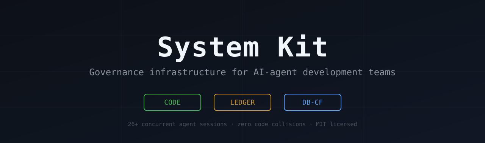
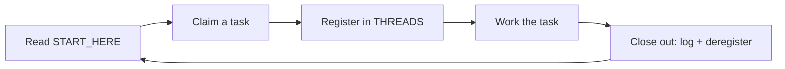

 

**Copy one folder into any project. Paste one prompt into any agent.
Get instant multi-thread coordination, task tracking, verification gates,
and institutional memory.**

---

> [!TIP]
> **No technical background needed.** Setup is one pasted prompt plus
> plain-English questions — your AI agent does all the file work.

## Why I Built This

I'm not a professional developer. I build products with AI agents — and I hit
every failure in the book the hard way: agents inventing code that didn't
exist, two agents silently destroying each other's work, API keys leaking
into chat context, broken code reaching production, context resets erasing
days of decisions, and numbers mislabeled until users noticed.

Each mistake cost real time, money, or trust. So I wrote down the system that
prevents each one — and proved it across **26+ concurrent AI-agent sessions
with zero code collisions**. System Kit is that system, released so nobody
else has to learn these lessons the expensive way.

| Failure | What it costs you |
|---|---|
| Two agents edit the same files | Lost work, broken builds |
| Agent invents APIs that don't exist | Confidently wrong implementations |
| Syntax errors ship untested | Dead pages in production |
| Context compaction mid-task | Re-researching the same problem twice |
| Cumulative data shown as daily | Users catch it before you do |
| Dead models eat your requests | Quotas burned on routing errors |
| Keys read into chat context | Secrets sent to external servers |

---

## Quick Start

**1. Get the kit** — click the green **Code** button above → **Download ZIP**,
then unzip it anywhere.

**2. Open your AI agent in your project** — opencode, Claude Code, Cursor,
or any agent that can read files and write to your project.

**3. Paste the setup prompt** — open `SETUP_PROMPT.md` from the unzipped kit,
copy its whole contents, paste as your first message, and tell the agent where
the kit folder is.

**4. Answer the questions** — the agent scans your project, asks about it in
plain English, then copies the kit's `docs/` folder into your project and
fills in every file for you. If your project already has a `docs/` folder
with its own documentation, the agent keeps governance files in a dedicated
subfolder instead of mixing them in.

**That's it.** You never edit files by hand. From now on, every new agent
thread starts at `docs/START_HERE.md` in your project.

> [!NOTE]
> See a [fully initialized START_HERE.md](examples/example-START_HERE.md) and a
> [live THREADS registry](examples/example-THREADS.md) to know what "done"
> looks like before you start.

---

## How It Works

Every agent thread follows one loop:

Collisions are prevented by the **three-mutex model** — separate locks for
separate concerns:

| Mutex | Guards | Hold duration |
|---|---|---|
| `CODE` | Source files | Task-long |
| `LEDGER` | Shared tracking docs | Seconds per edit |
| `DB-CF` | Database / cloud infrastructure | Action-long |

A docs-only thread needs only `LEDGER`, so it never waits behind a code
thread — and two code threads can never touch the same file.

---

## What You Get

| Capability | How |
|---|---|
| Multi-thread coordination | Three-mutex concurrency model with live thread registry |
| Task queue with claim/lock/release | Single entry point + priority queue + conflict detection |
| Verification gates | Local-first testing, five-step order, owner verifies last |
| Institutional memory | Append-only ledgers + checkpoint/resume system |
| Push discipline | Ledger currency required; owner-gated deployments |
| Key isolation | Credentials handled internally; never exposed to agents or logs |
| Plain-language owner gate | Decisions in simple English; owner interrupted only when needed |
| Optional model rotation | Live availability probing for rotating free-tier catalogs |

---

## Patterns Included

Each pattern documents the real failure class it prevents:

| Pattern | Prevents |
|---|---|
| [Concurrency Protocol](patterns/concurrency.md) | Parallel threads overwriting each other's work |
| [Verification Standard](patterns/verification.md) | Untested code reaching production |
| [Security Checklist](patterns/security-checklist.md) | Credential leaks, injection, unsafe defaults |
| [Failure Classes](patterns/failure-classes.md) | Twelve documented bug classes — with evidence |
| [Cost-Zero Operation](patterns/cost-zero-operation.md) | Quota burn and surprise cloud bills |
| [Model Rotation](patterns/model-rotation.md) | Dead/rotated free-tier models breaking sessions |
| [Prompt Injection Defense](patterns/prompt-injection-defense.md) | Malicious instructions hidden in project data |
| [Context Window Management](patterns/context-window-management.md) | Decisions lost to context compaction |
| [Worktree Parallel Coding](patterns/worktree-parallel.md) | Serialized code threads when true parallelism is needed |

---

## Who It's For

- **Non-technical founders** building with AI agents who can't afford silent failures
- **Solo developers** running several agent threads across projects
- **Small teams** whose agents keep overwriting each other
- **Anyone on free tiers** juggling rotating model catalogs

Works with any language, framework, host, AI provider, and any number of
concurrent threads. **Zero dependencies** — it's markdown methodology, not
software.

---

## Honest Limitations

> [!WARNING]
> This kit relies on agents *following documented protocols*. There is no
> runtime enforcement, no telemetry, no magic. If an agent ignores
> `THREADS.md`, nothing physically stops it — the kit makes correct behavior
> **explicit, checkable, and recoverable**, not automatic.
>
> Also: the mutex model assumes one shared filesystem (see the
> [worktree pattern](patterns/worktree-parallel.md) for true parallel edits),
> and templates are English-only.

---

## FAQ

**Do I need to be technical to use this?**
No. The setup is one pasted prompt plus plain-English questions — your AI
agent does the file work. You only ever make decisions.

**How is this different from just having an AGENTS.md?**
An AGENTS.md states rules; System Kit adds the machinery that makes rules
operational — a live lock registry, append-only history, checkpoint format,
and an initialization prompt that adapts all of it to your project.

**Does it work with my agent/tool?**
Yes. It's plain markdown — any LLM agent that can read and write files can
follow it (opencode, Claude Code, Cursor, Codex CLI, custom agents). Even a
web-chat agent without file access can initialize the system, because the
setup prompt embeds the full file-structure spec — but an in-project agent
gives the best results.

**Does it phone home or collect anything?**
No. Zero telemetry, zero network calls, zero data collection.

---

## Repository Layout

| Path | Purpose |
|---|---|
| [`SETUP_PROMPT.md`](SETUP_PROMPT.md) | Paste into a new thread → initializes governance (incl. troubleshooting appendix) |
| [`docs/`](docs/) | The governance files the agent copies into your project and fills in |
| [`patterns/`](patterns/) | Read-only references explaining why each rule exists |
| [`examples/`](examples/) | Worked examples: initialized START_HERE + live THREADS registry |
| [`integrations/`](integrations/) | Optional extras — e.g., GitHub Actions governance-compliance check |

---

## Community

- **[Discussions](https://github.com/moiz-za/system-kit/discussions)** — questions, ideas, and your agent collision stories
- **[Issues](https://github.com/moiz-za/system-kit/issues)** — bug reports and pattern proposals (evidence-required format in [CONTRIBUTING.md](CONTRIBUTING.md))

Patterns backed by **real incidents** are the most valuable contributions.

---

**MIT License** — use it anywhere, adapt it freely.

If System Kit saved your agents from each other, consider starring the repo —
it helps other teams find it.

